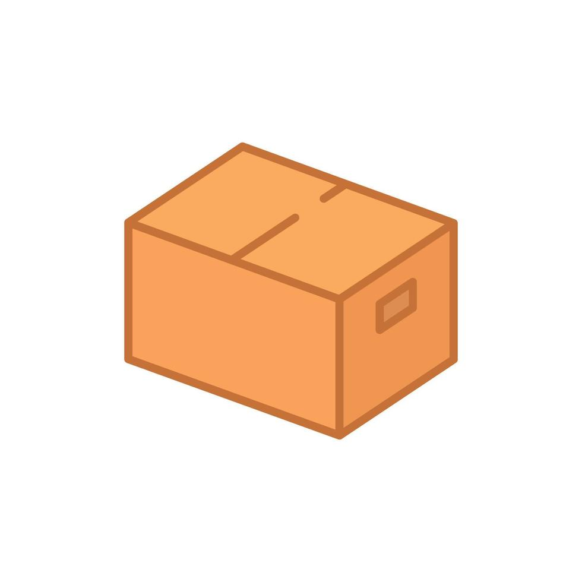

|  |  |
|:---------------------------------------:|:---------------------------------------:|
# Projeto DAE
## `API Documentation`
---

### `WeDelivery`

Esta API permite responder a todo o tipo de Pedidos necessários ao negócio da empresa WeDelivery, empresa ligada ao serviço de transporte e armazenamento de embalagens e produtos. Fornece endpoints para todas as funcionalidades da nossa Aplicação WEB.

---

#### Índice
 **1.** [Autenticação](#auth)
 **2.** [Operadores](#operators)
 **3.** [Gestores](#managers)
 **4.** [Clientes](#clients)
 **5.** [Encomendas](#orders)
 **6.** [Produtos](#products)
 **7.** [Armazéns](#warehouses)
 **8.** [Fabricantes](#suppliers)
 **9.** [Volumes](#volumes)
 **10.** [Sensores](#sensors)
 **11.** [Restrições](#restrictions)
&nbsp;&nbsp;&nbsp;&nbsp;&nbsp;&nbsp;[Créditos](#credits)

---

#### Base URL
#### `http://Localhost:8080/wedelivery/api`

---

## Endpoints
<div id='auth'/>  

### 1. **Autenticação**
#### `POST /auth/login`
Um User inicia sessão e recebe, para sua segurança, um token JWT.

- **URL**: `/auth/login`
- **Método**: `POST`
- **Headers**: 
  - `Content-Type`: `application/json`
- **Body**:
  ```json
  {
    "email": "user@example.com",
    "password": "password"
  }
  ```
- **Response**:
  ```json
  {
    "token": "jwt_token",
    "expires_in": 3600
  }
  ```
<br />

<div id='operators'/>  

### 2. **Operadores**
#### `GET /operators`
Um Administrador consulta a listagem de todos os Operadores Registados.

- **URL**: `/operators`
- **Método**: `GET`
- **Headers**: 
  - `Content-Type`: `application/json`
- **Response**:
  ```json
  {
    {
      "email":"Dinis@gmail.com",
      "name":"Dinis Roxo",
      "password":"password",
      "username":"DinisRX"
    },
    {
      "email":"Goncalo@gmail.com",
      "name":"Goncalo Ferreira",
      "password":"password",
      "username":"GoncaloF00"
    }
  }
  ```
<br />

#### `GET /operators/{username}`

Um Administrador consulta o perfil de um Operador.

- **URL**: `/operators/DinisRX`
- **Método**: `GET`
- **Headers**: 
  - `Content-Type`: `application/json`
- **Response**:
  ```json
  {
    "email":"Dinis@gmail.com",
    "name":"Dinis Roxo",
    "password":"password",
    "username":"DinisRX"
  }
  ```
<br />

#### `POST /operators`
Um Operador efetua o registo na plataforma do sistema.

- **URL**: `/operators`
- **Método**: `POST`
- **Headers**: 
  - `Content-Type`: `application/json`
- **Body**:
  ```json
  {
    "email": "ana@mail.com",
    "name": "Ana",
    "username": "Ana",
    "password": "password"
  }
  ```
- **Response**:
  ```json
  {
    "email": "ana@mail.com",
    "name": "Ana",
    "password": "password",
    "username": "Ana"
  }
  ```
<div id='managers'/>  

### 3. **Gestores**
#### `GET /managers`
Um Administrador consulta a listagem de todos os Gestores Registados.

- **URL**: `/managers`
- **Método**: `GET`
- **Headers**: 
  - `Content-Type`: `application/json`
- **Response**:
  ```json
  {
    {
      "email":"Rui@gmail.com",
      "name":"Rui Manager",
      "password":"password",
      "username":"RuiM100"
    },
    {
      "email":"Manager@gmail.com",
      "name":"André Silva",
      "password":"password",
      "username":"AndreS10"
    }
  }
  ```
<br />

#### `GET /managers/{username}`

Um Administrador consulta o perfil de um Gestor.

- **URL**: `/managers/Rui`
- **Método**: `GET`
- **Headers**: 
  - `Content-Type`: `application/json`
- **Response**:
  ```json
  {
    "email":"Rui@gmail.com",
    "name":"Rui Manager",
    "password":"password",
    "username":"RuiM100"
  }
  ```
<br />

#### `POST /managers`
Um Gestor efetua o registo na plataforma do sistema.

- **URL**: `/managers`
- **Método**: `POST`
- **Headers**: 
  - `Content-Type`: `application/json`
- **Body**:
  ```json
  {
    "email": "margarida@mail.com",
    "name": "Margarida",
    "username": "Margarida",
    "password": "password"
  }
  ```
- **Response**:
  ```json
  {
    "email": "margarida@mail.com",
    "name": "Margarida",
    "password": "password",
    "username": "Margarida"
  }
  ```
<br />

#### `GET /managers/{username}/orders`

Um Gestor consulta todas as encomendas a si associadas.

- **URL**: `/managers/DinisRX/orders`
- **Método**: `GET`
- **Headers**: 
  - `Content-Type`: `application/json`
- **Response**:
  ```json
  {
    "code": 3,
    "deliveryDate": "2024-10-18T13:38:32.823Z[UTC]",
    "purchaseDate": "2024-10-18T13:38:32.823Z[UTC]",
    "username": "Goncalo",
    "state": "In Distribution",
    "usernameOperator": "DinisRX"
  }
  ```
<br />

<div id='clients'/>  

### 4. **Clientes**
#### `GET /clients`
Um Administrador consulta a listagem de todos os Clientes Registados.

- **URL**: `/clients`
- **Método**: `GET`
- **Headers**: 
  - `Content-Type`: `application/json`
- **Response**:
  ```json
  {
   {
      "address": "Rua das Igrejas",
      "city": "Leiria",
      "country": "PT",
      "email": "guilherme@gmail.com",
      "name": "Guilherme",
      "nif": 123123124,
      "password": "password",
      "postalCode": "2565-834",
      "username": "Guilherme"
    },
    {
      "address": "Rua das Igrejas",
      "city": "Leiria",
      "country": "PT",
      "email": "cr7@gmail.com",
      "name": "Papai Cris",
      "nif": 123123125,
      "password": "password",
      "postalCode": "2565-834",
      "username": "Cristiano"
    }
  }
  ```
<br />

#### `GET /clients/{username}`

Um Administrador consulta o perfil de um Cliente.

- **URL**: `/clients/Goncalo`
- **Método**: `GET`
- **Headers**: 
  - `Content-Type`: `application/json`
- **Response**:
  ```json
  {
    "address": "Rua das Igrejas",
    "city": "Leiria",
    "country": "PT",
    "email": "goncalo@gmail.com",
    "name": "Gonçalo",
    "nif": 123123123,
    "orders": [
        {
            "code": 1372122800,
            "deliveryDate": "2024-10-22T15:47:16.764Z[UTC]",
            "purchaseDate": "2024-10-22T15:47:16.764Z[UTC]",
            "state": "Shipped",
            "username": "Goncalo",
            "usernameOperator": "GoncaloF00"
        },
        {
            "code": 1413200289,
            "deliveryDate": "2024-10-22T15:47:16.764Z[UTC]",
            "purchaseDate": "2024-10-22T15:47:16.764Z[UTC]",
            "state": "Delivered",
            "username": "Goncalo",
            "usernameOperator": "DinisRX"
        }
    ],
    "password": "password",
    "postalCode": "2565-834",
    "username": "Goncalo"
  }
  ```
<br />

#### `POST /clients`
Um Cliente efetua o registo na plataforma do sistema.

- **URL**: `/clients`
- **Método**: `POST`
- **Headers**: 
  - `Content-Type`: `application/json`
- **Body**:
  ```json
  {
    "username": "john",
    "email": "johndoe@mail.com",
    "password": "jd",
    "name": "John Doe",
    "courseCode": 1,
    "nif": 444555666,
    "postalCode": "2565-834",
    "country": "PT",
    "city": "Leiria",
    "address": "Rua x"
  }
  ```
- **Response**:
  ```json
  {
    "address": "Rua x",
    "city": "Leiria",
    "country": "PT",
    "email": "johndoe@mail.com",
    "name": "John Doe",
    "nif": 444555666,
    "password": "jd",
    "postalCode": "2565-834",
    "username": "john"
  }
  ```
<br />

#### `GET /clients/{username}/orders`

Um Cliente consulta todas as suas encomendas realizadas

- **URL**: `/clients/Goncalo/orders`
- **Método**: `GET`
- **Headers**: 
  - `Content-Type`: `application/json`
- **Response**:
  ```json
  {
    "code": 3,
    "deliveryDate": "2024-10-18T13:38:32.823Z[UTC]",
    "purchaseDate": "2024-10-18T13:38:32.823Z[UTC]",
    "username": "Goncalo",
    "state": "In Distribution",
    "usernameOperator": "DinisRX"
  }
  ```
<br />

<div id='orders'/>  

### 5. **Encomendas**
#### `GET /orders`
Um Gestor consulta a listagem de todos as Encomendas efetuadas.

- **URL**: `/orders`
- **Método**: `GET`
- **Headers**: 
  - `Content-Type`: `application/json`
- **Response**:
  ```json
  {
   {
      "code": 1,
      "deliveryDate": "2024-10-18T13:38:32.822Z[UTC]",
      "purchaseDate": "2024-10-18T13:38:32.822Z[UTC]",
      "username": "Guilherme",
      "state": "In Distribution",
      "usernameOperator": "DinisRX"
    },
    {
      "code": 2,
      "deliveryDate": "2024-10-18T13:38:32.823Z[UTC]",
      "purchaseDate": "2024-10-18T13:38:32.823Z[UTC]",
      "username": "Guilherme",
      "state": "In Distribution",
      "usernameOperator": "DinisRX"
    },
    {
      "code": 3,
      "deliveryDate": "2024-10-18T13:38:32.823Z[UTC]",
      "purchaseDate": "2024-10-18T13:38:32.823Z[UTC]",
      "username": "Goncalo",
      "state": "In Distribution",
      "usernameOperator": "DinisRX"
    }
  }
  ```
<br />

#### `GET /orders/{code}`

Um Gestor consulta uma Encomenda efetuada. Este método pode também ser usado por um Cliente que deseje consultar uma Encomenda efetuada por si. 

- **URL**: `/orders/1258464486`
- **Método**: `GET`
- **Headers**: 
  - `Content-Type`: `application/json`
- **Response**:
  ```json
  {
    "code": 1258464486,
    "deliveryDate": "2024-10-24T23:16:00.949Z[UTC]",
    "purchaseDate": "2024-10-24T23:16:00.949Z[UTC]",
    "state": "Pending",
    "username": "Guilherme",
    "usernameOperator": "DinisRX",
    "volumes": [
      {
        "creationDate": "2024-10-24 23:16:00.991",
        "id": 1494305280,
        "state": "Minor damage"
      }
    ]
  }
  ```
<br />

#### `GET /orders/{code}/volume/{id}`

Um Gestor consulta uma Encomenda efetuada e quere verificar um volume. Este método pode também ser usado por um Cliente que deseje consultar uma Encomenda efetuada por si. 

- **URL**: `/orders/1494305280/volume/3`
- **Método**: `GET`
- **Headers**: 
  - `Content-Type`: `application/json`
- **Response**:
  ```json
  {
    "creationDate": "2024-10-24 23:16:00.991",
    "id": 1494305280,
    "products": [
      {
        "available": true,
        "description": "Sprite",
        "haveSensor": false,
        "id": 3,
        "image": "sprite.jpg",
        "name": "Sprite",
        "price": 1.5,
        "quantity": 100
      },
      {
        "available": true,
        "description": "Fanta",
        "haveSensor": false,
        "id": 4,
        "image": "fanta.jpg",
        "name": "Fanta",
        "price": 1.5,
        "quantity": 100
      }
    ],
    "sensors": [
      {
        "busy": false,
        "currentValue": 20,
        "expedition": false,
        "id": 3,
        "type": "Temperature"
      },
      {
        "busy": false,
        "currentValue": 20,
        "expedition": false,
        "id": 23,
        "type": "humidity"
      }
    ],
    "state": "Minor damage"
  }
  ```
<br />

#### `POST /orders`
Um Cliente efetua uma Encomenda e a mesma é criada em sistema.

- **URL**: `/orders`
- **Método**: `POST`
- **Headers**: 
  - `Content-Type`: `application/json`
- **Body**:
  ```json
  {
    "code": 1930548778,
    "deliveryDate": "2024-10-20T23:02:22.383Z[UTC]",
    "purchaseDate": "2024-10-20T23:02:22.383Z[UTC]",
    "state": "Pending",
    "username": "Guilherme",
    "usernameOperator": "DinisRX"
  }
  ```
- **Response**:
  ```json
  {
    "code": 1930548778,
    "deliveryDate": "2024-10-20T23:02:22.383Z[UTC]",
    "purchaseDate": "2024-10-20T23:02:22.383Z[UTC]",
    "state": "Pending",
    "username": "Guilherme",
    "usernameOperator": "DinisRX"
  }
  ```
<br />

#### `PATCH /orders/{id}`
Um gestor altera o estado de uma encomenda especificada por {id}.
- **URL:** `/orders/761527421`
- **Método**: `PATCH`
- **Headers:** 
  - `Content-Type`: `application/json`
- **Body:**
  ```json
  {
    "state": "Delivered"
  }
- **Response:**
  ```json
  {
    "code": 761527421,
    "deliveryDate": "2024-10-25T14:11:00.389Z[UTC]",
    "purchaseDate": "2024-10-25T14:11:00.389Z[UTC]",
    "state": "Delivered",
    "username": "Guilherme",
    "usernameOperator": "DinisRX"
  }
  ```
<br />

<div id='products'/>  

### 6. **Produtos**

#### `Get /products`
Um utilizador consulta todos os produtos na página de e-commerce.

- **URL**: `/products`
- **Método**: `GET`
- **Headers**: 
  - `Content-Type`: `application/json`
- **Response**:
  ```json
  [
    {
      "available": true,
      "description": "Coca-Cola",
      "haveSensor": false,
      "id": 1,
      "image": "coca-cola.jpg",
      "name": "Coca-Cola",
      "price": 1.5,
      "quantity": 0,
      "warehouseName": "Leiria"
    },
    ...,
    {
      "available": true,
      "description": "Sumol",
      "haveSensor": false,
      "id": 6,
      "image": "sumol.jpg",
      "name": "Sumol",
      "price": 1.5,
      "quantity": 100,
      "warehouseName": "Leiria"
    }
  ]
  ```
<br/>

#### `Get /products/{id}`

Um utilizador consulta um produto especifico.

- **URL**: `/products/2`
- **Método**: `GET`
- **Headers**: 
  - `Content-Type`: `application/json`
- **Response**:
  ```json
  {
    "available": true,
    "description": "Pepsi",
    "haveSensor": false,
    "id": 2,
    "image": "pepsi.jpg",
    "name": "Pepsi",
    "price": 1.5,
    "quantity": 2,
    "warehouseName": "Leiria"
  }
  ```
<br />

#### `Get /products/{name}`
Um utilizador consulta todos os produtos que contenham a palavra {name}.
- **URL**: `/products/S`
- **Método**: `GET`
- **Headers**: 
  - `Content-Type`: `application/json`
- **Response**:
  ```json
  [
    {
      "available": true,
      "description": "Sprite",
      "haveSensor": false,
      "id": 3,
      "image": "sprite.jpg",
      "name": "Sprite",
      "price": 1.5,
      "quantity": 100,
      "warehouseName": "Leiria"
    },
    ...,
    {
      "available": true,
      "description": "Sumol",
      "haveSensor": false,
      "id": 6,
      "image": "sumol.jpg",
      "name": "Sumol",
      "price": 1.5,
      "quantity": 100,
      "warehouseName": "Leiria"
    }
  ]
  ```
<br />

#### `GET /products/{id}/details`
Um utilizador consulta os detalhes de um repectivo produto.
- **URL**: `/products/1/details`
- **Método**: `GET`
- **Headers**: 
  - `Content-Type`: `application/json`
- **Response**
  ```json
  {
  "available": true,
  "description": "Coca-Cola",
  "haveSensor": false,
  "id": 1,
  "image": "coca-cola.jpg",
  "name": "Coca-Cola",
  "price": 1.5,
  "quantity": 0,
  "supplier": {
      "email": "safari@mail.com",
      "name": "Safari, LDA",
      "password": "qwerty",
      "username": "safari"
    },
    "warehouse": {
      "address": "Rua das Igrejas",
      "city": "Leiria",
      "name": "Leiria",
      "postalCode": "2565-834"
    }
  }
  ```
<br />

<div id='warehouses'/>  

### 7. **Armazéns**
#### `Get /warehouses`
Um utilizador consulta os warehouses existentes.
- **URL**: `/warehouses`
- **Método**: `GET`
- **Headers**: 
  - `Content-Type`: `application/json`
- **Response**:
  ```json
  [
    {
      "address": "Rua das Igrejas",
      "city": "Leiria",
      "name": "Leiria",
      "postalCode": "2565-834"
    },
    ...,
    {
      "address": "Rua das Igrejas",
      "city": "Porto",
      "name": "Porto",
      "postalCode": "2565-834"
    }
  ]
  ```
<br />

#### `Get /warehouses/{name}`
Um utilizador consulta os dados de um warehouse especifico.
- **URL**: `/warehouses/Leiria`
- **Método**: `GET`
- **Headers**: 
  - `Content-Type`: `application/json`
- **Response**:
  ```json
  {
    "address": "Rua das Igrejas",
    "city": "Leiria",
    "name": "Leiria",
    "postalCode": "2565-834"
  }
  ```
<br />

#### `Get /warehouses/{name}/products`
Um utilizador consulta todos os produtos que exitem num determindo warehouse.
- **URL**: `/warehouses/Leiria/products`
- **Método**: `GET`
- **Headers**: 
  - `Content-Type`: `application/json`
- **Response**:
  ```json
  {
    "address": "Rua das Igrejas",
    "city": "Leiria",
    "name": "Leiria",
    "postalCode": "2565-834",
    "products": [
      {
        "available": true,
        "description": "Coca-Cola",
        "haveSensor": false,
        "id": 1,
        "image": "coca-cola.jpg",
        "name": "Coca-Cola",
        "price": 1.5,
        "quantity": 0
      },
      ...,
      {
        "available": true,
        "description": "Sprite",
        "haveSensor": false,
        "id": 3,
        "image": "sprite.jpg",
        "name": "Sprite",
        "price": 1.5,
        "quantity": 100
      }
    ]
  }
  ```
<br />

#### `Get /warehouses/{name}/products/{id}`
Um utilizador consulta um determinado produto {id} num determinado warehouse {name}.
- **URL**: `/warehouses/Leiria/products/1`
- **Método**: `GET`
- **Headers**: 
  - `Content-Type`: `application/json`
- **Response**:
  ```json
  {
    "address": "Rua das Igrejas",
    "city": "Leiria",
    "name": "Leiria",
    "postalCode": "2565-834",
    "products": [
      {
        "available": true,
        "description": "Coca-Cola",
        "haveSensor": false,
        "id": 1,
        "image": "coca-cola.jpg",
        "name": "Coca-Cola",
        "price": 1.5,
        "quantity": 0,
        "supplier": {
          "email": "safari@mail.com",
          "name": "Safari, LDA",
          "password": "qwerty",
          "username": "safari"
        }
      }
    ]
  }
  ```
<br />

<div id='suppliers'/>  

### 8. **Fabricantes**
#### `GET /suppliers`
Um utilizador consulta os Suppliers existentes
 **URL**: `/suppliers`
- **Método**: `GET`
- **Headers**: 
  - `Content-Type`: `application/json`
- **Response**:
  ```json
  [
    {
      "email": "drinklfa@mail.com",
      "name": "DrinkLFA, LDA",
      "password": "qwerty",
      "username": "drinkLFA"
    },
    ...,
    {
      "email": "safari@mail.com",
      "name": "Safari, LDA",
      "password": "qwerty",
      "username": "safari"
    }
  ]
  ```
<br />

#### `GET /suppliers/{name}` ou `/suppliers/{name}/products`
Um utilizador consulta um determinado Supplier e os seus respectivos produtos
 - **URL:** `/suppliers/safari`
- **Método**: `GET`
- **Headers:** 
  - `Content-Type`: `application/json`
- **Response:**
  ```json
  {
    "email": "safari@mail.com",
    "name": "Safari, LDA",
    "password": "qwerty",
    "products": [
      {
        "available": true,
        "description": "Coca-Cola",
        "haveSensor": false,
        "id": 1,
        "image": "coca-cola.jpg",
        "name": "Coca-Cola",
        "price": 1.5,
        "quantity": 0
      },
      ...,
      {
        "available": true,
        "description": "Sumol",
        "haveSensor": false,
        "id": 6,
        "image": "sumol.jpg",
        "name": "Sumol",
        "price": 1.5,
        "quantity": 100
      }
    ],
    "username": "safari"
  }
  ```
<br />

#### `GET /suppliers/{name}/products/{id}`

Um utilizador efetua a consulta de um produto identificado por {id}, pertencente a um fornecedor designado por {name}.
- **URL:** `/suppliers/safari/products/2`
- **Método**: `GET`
- **Headers:** 
  - `Content-Type`: `application/json`
- **Response:**
  ```json
  {
    "email": "safari@mail.com",
    "name": "Safari, LDA",
    "password": "qwerty",
    "products": [
      {
        "available": true,
        "description": "Pepsi",
        "haveSensor": false,
        "id": 2,
        "image": "pepsi.jpg",
        "name": "Pepsi",
        "price": 1.5,
        "quantity": 2
      }
    ],
    "username": "safari"
  }
  ```
<br />

#### `GET /suppliers/{name}/products/name/{string}`
Um utilizador consulta diversos produtos com a designação {string}, pertencentes ao fornecedor identificado por {name}.
 - **URL:** `/suppliers/safari/products/name/S`
- **Método**: `GET`
- **Headers:** 
  - `Content-Type`: `application/json`
- **Response:**
  ```json
  {
    "email": "safari@mail.com",
    "name": "Safari, LDA",
    "password": "qwerty",
    "products": [
      {
        "available": true,
        "description": "Sprite",
        "haveSensor": false,
        "id": 3,
        "image": "sprite.jpg",
        "name": "Sprite",
        "price": 1.5,
        "quantity": 100
      },
      ...,
      {
        "available": true,
        "description": "Sumol",
        "haveSensor": false,
        "id": 6,
        "image": "sumol.jpg",
        "name": "Sumol",
        "price": 1.5,
        "quantity": 100
      }
    ],
    "username": "safari"
  }
  ```
<br />

<div id='volumes'/>  

### 9. **Volumes**
#### `GET /volumes`
Um administrador consulta os volumes existentes.
- **URL:** `/volumes`
- **Método**: `GET`
- **Headers:** 
  - `Content-Type`: `application/json`
- **Response:**
  ```json
  [
    {
      "creationDate": "2024-10-24 00:00:00.0",
      "id": 121270755,
      "state": "Significant damage"
    },
    ...,
    {
      "creationDate": "2024-10-24 16:01:54.077",
      "id": 1019509487,
      "state": "Moderate damage"
    }
  ]
  ```
<br />

#### `GET /volumes/{id}`
Um administrador consulta um volume registado.
- **URL:** `/volumes/1058107426`
- **Método**: `GET`
- **Headers:** 
  - `Content-Type`: `application/json`
- **Response:**
  ```json
    {
    "creationDate": "2024-10-24 20:36:54.968",
    "id": 1058107426,
    "products": [
      {
        "available": true,
        "description": "7up",
        "haveSensor": false,
        "id": 5,
        "image": "7up.jpg",
        "name": "7up",
        "price": 1.5,
        "quantity": 100
      },
      ...,
      {
        "available": true,
        "description": "Sumol",
        "haveSensor": false,
        "id": 6,
        "image": "sumol.jpg",
        "name": "Sumol",
        "price": 1.5,
        "quantity": 100
      }
    ],
    "sensors": [
      {
        "busy": false,
        "currentValue": 20,
        "expedition": false,
        "id": 5,
        "type": "Temperature"
      },
      ...,
      {
        "busy": false,
        "currentValue": 20,
        "expedition": false,
        "id": 25,
        "type": "humidity"
      }
    ],
    "state": "Moderate damage"
  }
  ```
<br />

#### `GET /volumes/{id}/details`
Um administrador consulta, ao detalhe, um volume registado.
- **URL:** `/volumes/1058107426/details`
- **Método**: `GET`
- **Headers:** 
  - `Content-Type`: `application/json`
- **Response:**
  ```json
  {
    "creationDate": "2024-10-24 20:36:54.968",
    "id": 1058107426,
    "products": [
      {
        "available": true,
        "description": "7up",
        "haveSensor": false,
        "id": 5,
        "image": "7up.jpg",
        "name": "7up",
        "price": 1.5,
        "quantity": 100,
        "supplier": {
          "email": "safari@mail.com",
          "name": "Safari, LDA",
          "password": "qwerty",
          "username": "safari"
        },
        "warehouse": {
          "address": "Rua das Igrejas",
          "city": "Leiria",
          "name": "Leiria",
          "postalCode": "2565-834"
        }
      },
      {
        "available": true,
        "description": "Sumol",
        "haveSensor": false,
        "id": 6,
        "image": "sumol.jpg",
        "name": "Sumol",
        "price": 1.5,
        "quantity": 100,
        "supplier": {
          "email": "safari@mail.com",
          "name": "Safari, LDA",
          "password": "qwerty",
          "username": "safari"
        },
        "warehouse": {
          "address": "Rua das Igrejas",
          "city": "Leiria",
          "name": "Leiria",
          "postalCode": "2565-834"
        }
      }
    ],
    "sensors": [
      {
        "busy": false,
        "currentValue": 20,
        "expedition": false,
        "id": 5,
        "type": "Temperature"
      },
      {
        "busy": false,
        "currentValue": 20,
        "expedition": false,
        "id": 25,
        "type": "humidity"
      }
    ],
    "state": "Moderate damage"
  }
  ```
<br />

<div id='sensors'/>  

### 10. **Sensores**
#### `GET /sensors`
Um gestor consulta os sensores existentes.
- **URL:** `/sensors`
- **Método**: `GET`
- **Headers:** 
  - `Content-Type`: `application/json`
- **Response:**
  ```json
  [
    {
        "busy": false,
        "currentValue": 20,
        "expedition": false,
        "id": 2,
        "type": "Temperature"
    },
    {
        "busy": false,
        "currentValue": 20,
        "expedition": false,
        "id": 4,
        "type": "Temperature"
    }
  ]
  ```
<br />

#### `GET /sensors/{id}`
Um gestor consulta um sensor em específico.
- **URL:** `/sensors/2`
- **Método**: `GET`
- **Headers:** 
  - `Content-Type`: `application/json`
- **Response:**
  ```json
  {
    "busy": false,
    "currentValue": 20,
    "expedition": false,
    "id": 2,
    "type": "Temperature"
  }
  ```
<br />

#### `GET /sensors/{id}/details`
Um gestor consulta detalhadamente um sensor em específico, contendo assim a informação do volume associado ao sensor especificado.
- **URL:** `/sensors/1`
- **Método**: `GET`
- **Headers:** 
  - `Content-Type`: `application/json`
- **Response:**
  ```json
  {
    "busy": false,
    "currentValue": 20,
    "expedition": false,
    "id": 1,
    "type": "Temperature",
    "volume": {
        "creationDate": "2024-10-25 10:47:49.814",
        "id": 662380363,
        "state": "No damage"
    }
  }
  ```
<br />

#### `PATCH /sensors/{id}`
Um gestor altera o valor atual de um sensor especificando o seu {id}.
- **URL:** `/sensors/1`
- **Método**: `PATCH`
- **Headers:** 
  - `Content-Type`: `application/json`
- **Body:**
  ```json
  {
    "currentValue": 50
  }
- **Response:**
  ```json
  {
    "busy": false,
    "currentValue": 50,
    "expedition": false,
    "id": 1,
    "type": "Temperature"
  }
  ```
<br />

<div id='restrictions'/>  

### 11. **Restrições**
#### `GET /restrictions`
Um gestor consulta as restrições existentes.
- **URL:** `/restrictions`
- **Método**: `GET`
- **Headers:** 
  - `Content-Type`: `application/json`
- **Response:**
  ```json
  [
    {
      "id": 1,
      "maxValue": 25.4,
      "minValue": 19.5,
      "products": [],
      "type": "Temperature"
    },
    {
      "id": 2,
      "maxValue": 25.4,
      "minValue": 99.0,
      "products": [],
      "type": "Humidity"
    }
  ]
  ```
<br />

#### `GET /restrictions{id}`
Um gestor consulta uma restrição em específico.
- **URL:** `/restrictions/1`
- **Método**: `GET`
- **Headers:** 
  - `Content-Type`: `application/json`
- **Response:**
  ```json
  {
    "id": 1,
    "maxValue": 25.4,
    "minValue": 19.5,
    "products": [],
    "type": "Temperature"
  }
  ```
<br />

#### `GET /restrictions{id}/details`
Um gestor consulta detalhadamente uma restrição em específico, obtendo também os produtos associados à mesma.
- **URL:** `/restrictions/1/details`
- **Método**: `GET`
- **Headers:** 
  - `Content-Type`: `application/json`
- **Response:**
  ```json
  {
    "id": 1,
    "maxValue": 25.4,
    "minValue": 19.5,
    "products": [
      {
        "available": true,
        "description": "Coca-Cola",
        "haveSensor": false,
        "id": 1,
        "image": "coca-cola.jpg",
        "name": "Coca-Cola",
        "price": 1.5,
        "quantity": -3
      },
      {
        "available": true,
        "description": "Pepsi",
        "haveSensor": false,
        "id": 2,
        "image": "pepsi.jpg",
        "name": "Pepsi",
        "price": 1.5,
        "quantity": 0
      }
    ],
    "type": "Temperature"
  }
  ```
<br />


---
<div id='credits'/>  

## **Créditos**
#### `Powered By`
##### `2222051` [@goncaloferreira966](https://github.com/goncaloferreira966) 
##### `2223281` [@GuilhermeCruzPT](https://github.com/GuilhermeCruzPT)   
##### `2222313` [dinisroxo99](https://github.com/dinisroxo99)     

---

#### `Cliente`
##### `Professor` João Ferreira


---
